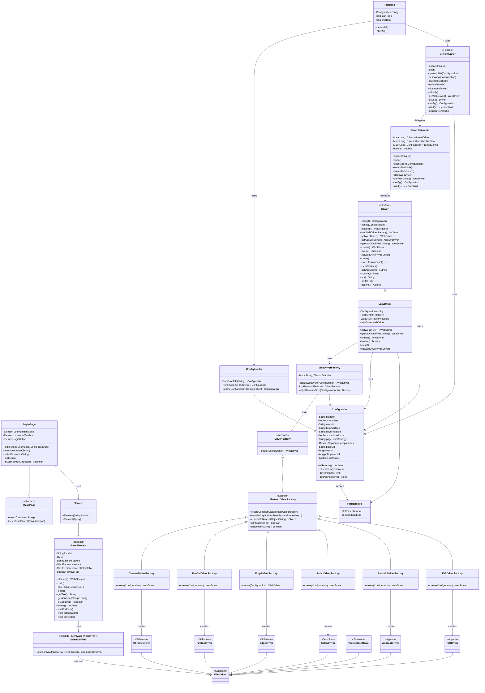

```mermaid
classDiagram

%% =========================
%% TEST / POM
%% =========================

class TestBase {
    -Configuration config
    -long startTime
    -long endTime
    +beforeAll(...)
    +afterAll()
}

class BasePage {
    <<abstract>>
    +selectCustomer(String)
    +selectCustomer(String, boolean)
}

class LoginPage {
    -Element usernameTextBox
    -Element passwordTextBox
    -Element loginButton
    +login(String username, String password)
    +enterUsername(String)
    +enterPassword(String)
    +clickLogin()
    +isLoginButtonDisplayed() boolean
}

TestBase --> ConfigLoader : uses
TestBase --> DriverRunner : uses

LoginPage --|> BasePage
LoginPage --> Element : uses


%% =========================
%% ELEMENT
%% =========================

class BaseElement {
    <<abstract>>
    -String locator
    -By by
    -BaseElement parent
    -WebElement element
    -WebElement elementIntractable
    -boolean alwaysFind

    +element() WebElement
    +click()
    +enter(CharSequence...)
    +clear()
    +getText() String
    +getAttribute(String) String
    +isDisplayed() boolean
    +exists() boolean
    +waitForExist()
    +waitForClickable()
    +waitForVisible()
}

class Element {
    +Element(String locator)
    +Element(By by)
}

Element --|> BaseElement


%% =========================
%% WAIT
%% =========================

class SeleniumWait {
    <<extends FluentWait~WebDriver~>>
    +SeleniumWait(WebDriver, long timeout, long pollingInterval)
}

BaseElement --> SeleniumWait : uses
SeleniumWait --> WebDriver : waits on


%% =========================
%% DRIVER
%% =========================

class DriverRunner {
    <<Facade>>
    +open(String url)
    +open()
    +openMobile(Configuration)
    +setConfig(Configuration)
    +switchToMobile()
    +switchToWeb()
    +closeWebDriver()
    +refresh()
    +getWebDriver() WebDriver
    +driver() Driver
    +config() Configuration
    +Wait() SeleniumWait
    +actions() Actions
}

class DriverContainer {
    -Map~Long, Driver~ threadDriver
    -Map~Long, Driver~ threadMobileDriver
    -Map~Long, Configuration~ threadConfig
    -boolean isMobile

    +open(String url)
    +open()
    +openMobile(Configuration)
    +switchToMobile()
    +switchToBrowser()
    +closeWebDriver()
    +getWebDriver() WebDriver
    +config() Configuration
    +Wait() SeleniumWait
}

class Driver {
    <<interface>>
    +config() Configuration
    +config(Configuration)
    +platform() PlatformInfo
    +hasWebDriverStarted() boolean
    +getWebDriver() WebDriver
    +getAppiumDriver() AppiumDriver
    +getAndCheckWebDriver() WebDriver
    +create() WebDriver
    +isAlive() boolean
    +setWebDriver(WebDriver)
    +close()
    +executeJavaScript(...)
    +clearCookies()
    +getUserAgent() String
    +source() String
    +url() String
    +switchTo()
    +actions() Actions
}

class LazyDriver {
    -Configuration config
    -PlatformInfo platform
    -WebDriverFactory factory
    -WebDriver webDriver

    +getWebDriver() WebDriver
    +getAndCheckWebDriver() WebDriver
    +create() WebDriver
    +isAlive() boolean
    +close()
    +setWebDriver(WebDriver)
}

DriverRunner --> DriverContainer : delegates
DriverContainer --> Driver : manages
Driver <|.. LazyDriver
LazyDriver --> WebDriverFactory : uses


%% =========================
%% FACTORY
%% =========================

class WebDriverFactory {
    -Map~String, Class~ factories
    +createWebDriver(Configuration) WebDriver
    -findFactory(Platform) DriverFactory
    -adjustBrowserSize(Configuration, WebDriver)
}

class DriverFactory {
    <<interface>>
    +create(Configuration) WebDriver
}

class AbstractDriverFactory {
    <<abstract>>
    +createCommonCapabilities(Configuration)
    +transferCapabilitiesFromSystemProperties(...)
    +convertToNearestObject(String) Object
    +isInteger(String) boolean
    +isBoolean(String) boolean
}

class ChromeDriverFactory {
    +create(Configuration) WebDriver
}

class FirefoxDriverFactory {
    +create(Configuration) WebDriver
}

class EdgeDriverFactory {
    +create(Configuration) WebDriver
}

class SafariDriverFactory {
    +create(Configuration) WebDriver
}

class AndroidDriverFactory {
    +create(Configuration) WebDriver
}

class IOSDriverFactory {
    +create(Configuration) WebDriver
}

WebDriverFactory --> DriverFactory : finds

DriverFactory <|.. AbstractDriverFactory

AbstractDriverFactory <|-- ChromeDriverFactory
AbstractDriverFactory <|-- FirefoxDriverFactory
AbstractDriverFactory <|-- EdgeDriverFactory
AbstractDriverFactory <|-- SafariDriverFactory
AbstractDriverFactory <|-- AndroidDriverFactory
AbstractDriverFactory <|-- IOSDriverFactory

WebDriverFactory --> Configuration


%% =========================
%% CONFIGURATION
%% =========================

class Configuration {
    -String platform
    -boolean headless
    -String remote
    -String browserSize
    -String driverVersion
    -boolean startMaximized
    -String pageLoadStrategy
    -MutableCapabilities capabilities
    -String baseUrl
    -long timeout
    -long pollingInterval
    -boolean clickViaJs

    +isRemote() boolean
    +isHeadless() boolean
    +getTimeout() long
    +getPollingInterval() long
}

class ConfigLoader {
    +fromJsonFile(String) Configuration
    +fromPropertyFile(String) Configuration
    +updateConfiguration(Configuration) Configuration
}

ConfigLoader --> Configuration
DriverRunner --> Configuration : sets
DriverContainer --> Configuration : uses
LazyDriver --> Configuration : uses


%% =========================
%% PLATFORM
%% =========================

class PlatformInfo {
    -Platform platform
    -boolean headless
}

LazyDriver --> PlatformInfo
Configuration --> PlatformInfo : defines


%% =========================
%% SELENIUM / APPIUM
%% =========================

class WebDriver {
    <<Selenium>>
}

class ChromeDriver {
    <<Selenium>>
}

class FirefoxDriver {
    <<Selenium>>
}

class EdgeDriver {
    <<Selenium>>
}

class SafariDriver {
    <<Selenium>>
}

class RemoteWebDriver {
    <<Selenium>>
}

class AndroidDriver {
    <<Appium>>
}

class IOSDriver {
    <<Appium>>
}

ChromeDriver --|> WebDriver
FirefoxDriver --|> WebDriver
EdgeDriver --|> WebDriver
SafariDriver --|> WebDriver
RemoteWebDriver --|> WebDriver
AndroidDriver --|> WebDriver
IOSDriver --|> WebDriver

ChromeDriverFactory --> ChromeDriver : creates
FirefoxDriverFactory --> FirefoxDriver : creates
EdgeDriverFactory --> EdgeDriver : creates
SafariDriverFactory --> SafariDriver : creates
AndroidDriverFactory --> AndroidDriver : creates
IOSDriverFactory --> IOSDriver : creates
```
