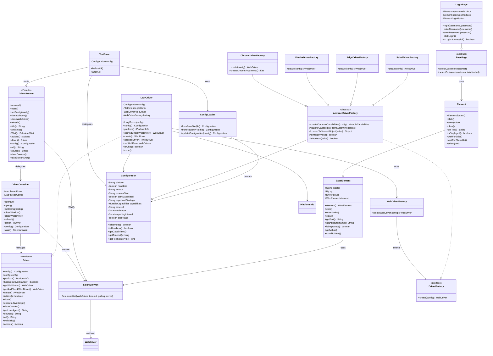

```mermaid
classDiagram
    direction TB

    class TestBase {
        +beforeAll()
        +afterAll()
        -Configuration config
    }

    class LoginPage {
        +login(username, password)
        +enterUsername(username)
        +enterPassword(password)
        +clickLogin()
        +isLoginSuccessful() boolean
        -Element usernameTextBox
        -Element passwordTextBox
        -Element loginButton
    }

    class BasePage {
        <<abstract>>
        +selectCustomer(customer)
        +selectCustomer(customer, isIndividual)
    }

    class Element {
        +Element(locator)
        +click()
        +enter(value)
        +clear()
        +getText() String
        +isDisplayed() boolean
        +waitForExist()
        +waitForClickable()
        +select(text)
    }

    class BaseElement {
        #String locator
        #By by
        #Driver driver
        #WebElement element
        +element() WebElement
        +click()
        +enter(value)
        +clear()
        +getText() String
        +getAttribute(name) String
        +isDisplayed() boolean
        +getValue()
        +scrollToView()
    }

    class DriverRunner {
        <<Facade>>
        +open(url)
        +open()
        +setConfig(config)
        +closeWindow()
        +closeWebDriver()
        +refresh()
        +title() String
        +switchTo()
        +Wait() SeleniumWait
        +actions() Actions
        +driver() Driver
        +config() Configuration
        +url() String
        +source() String
        +clearCookies()
        +takeScreenShot()
    }

    class DriverContainer {
        -Map threadDriver
        -Map threadConfig
        +open(url)
        +open()
        +setConfig(config)
        +closeWindow()
        +closeWebDriver()
        +refresh()
        +driver() Driver
        +config() Configuration
        +Wait() SeleniumWait
    }

    class Driver {
        <<interface>>
        +config() Configuration
        +config(config)
        +platform() PlatformInfo
        +hasWebDriverStarted() boolean
        +getWebDriver() WebDriver
        +getAndCheckWebDriver() WebDriver
        +create() WebDriver
        +isAlive() boolean
        +close()
        +executeJavaScript()
        +clearCookies()
        +getUserAgent() String
        +source() String
        +url() String
        +switchTo()
        +actions() Actions
    }

    class LazyDriver {
        -Configuration config
        -PlatformInfo platform
        -WebDriver webDriver
        -WebDriverFactory factory
        +LazyDriver(config)
        +config() Configuration
        +platform() PlatformInfo
        +getAndCheckWebDriver() WebDriver
        +create() WebDriver
        +getWebDriver() WebDriver
        +setWebDriver(webDriver)
        +isAlive() boolean
        +close()
    }

    class SeleniumWait {
        +SeleniumWait(WebDriver, timeout, pollingInterval)
    }

    class WebDriverFactory {
        +createWebDriver(config) WebDriver
    }

    class DriverFactory {
        <<interface>>
        +create(config) WebDriver
    }

    class AbstractDriverFactory {
        <<abstract>>
        +createCommonCapabilities(config) MutableCapabilities
        #transferCapabilitiesFromSystemProperties()
        #convertToNearestObject(value) Object
        #isInteger(value) boolean
        #isBoolean(value) boolean
    }

    class ChromeDriverFactory {
        +create(config) WebDriver
        #createChromeArguments() List
    }

    class FirefoxDriverFactory {
        +create(config) WebDriver
    }

    class EdgeDriverFactory {
        +create(config) WebDriver
    }

    class SafariDriverFactory {
        +create(config) WebDriver
    }

    class Configuration {
        -String platform
        -boolean headless
        -String remote
        -String browserSize
        -boolean startMaximized
        -String pageLoadStrategy
        -MutableCapabilities capabilities
        -String baseUrl
        -Duration timeout
        -Duration pollingInterval
        -boolean clickViaJs
        +isRemote() boolean
        +isHeadless() boolean
        +getCapabilities()
        +getTimeout() long
        +getPollingInterval() long
    }

    class ConfigLoader {
        +fromJsonFile(file) Configuration
        +fromPropertyFile(file) Configuration
        +updateConfiguration(config) Configuration
    }

    TestBase --> ConfigLoader : loads
    TestBase --> Configuration : configures
    TestBase --> DriverRunner : starts

    LoginPage --|> BasePage
    BasePage --> Element : uses
    Element --|> BaseElement

    DriverRunner --> DriverContainer : delegates
    DriverContainer --> Driver : manages
    DriverContainer --> SeleniumWait : creates

    LazyDriver ..|> Driver
    LazyDriver --> WebDriverFactory : uses
    LazyDriver --> Configuration
    LazyDriver --> PlatformInfo

    WebDriverFactory --> DriverFactory : selects

    ChromeDriverFactory --|> AbstractDriverFactory
    FirefoxDriverFactory --|> AbstractDriverFactory
    EdgeDriverFactory --|> AbstractDriverFactory
    SafariDriverFactory --|> AbstractDriverFactory

    AbstractDriverFactory ..|> DriverFactory
    AbstractDriverFactory --> Configuration

    DriverRunner --> SeleniumWait : Wait()
    BaseElement --> SeleniumWait : uses
    SeleniumWait --> WebDriver : waits on

    ConfigLoader --> Configuration : creates
```
