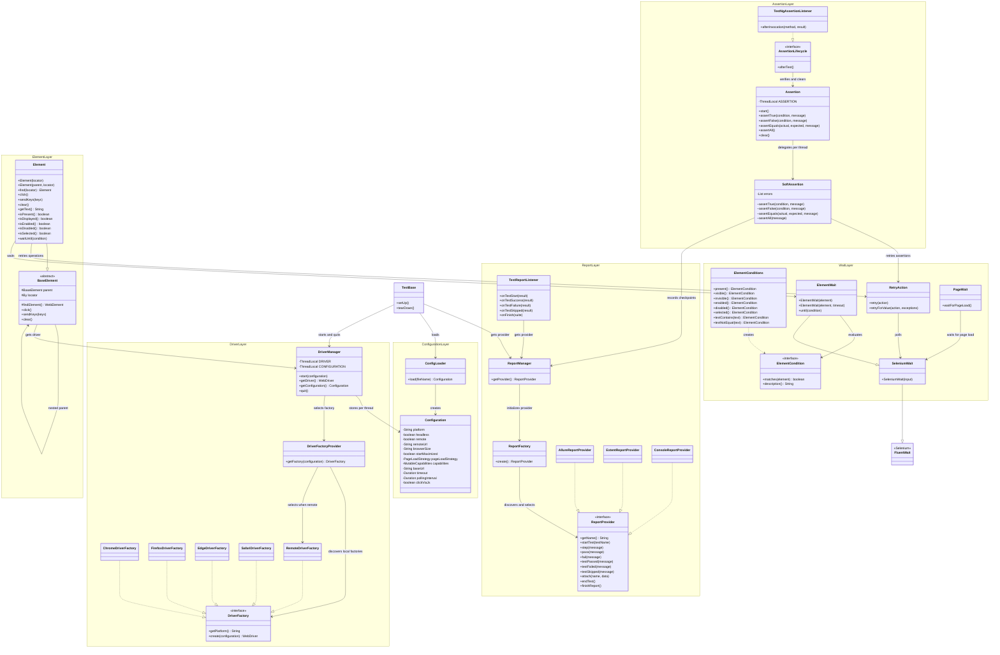

## Architecture

```mermaid
classDiagram
    direction TB

    namespace ConfigurationLayer {
        class ConfigLoader {
            +load(fileName) Configuration
        }
        class Configuration {
            -String platform
            -boolean headless
            -boolean remote
            -String remoteUrl
            -String browserSize
            -boolean startMaximized
            -PageLoadStrategy pageLoadStrategy
            -MutableCapabilities capabilities
            -String baseUrl
            -Duration timeout
            -Duration pollingInterval
            -boolean clickViaJs
        }
    }

    namespace DriverLayer {
        class DriverManager {
            -ThreadLocal DRIVER
            -ThreadLocal CONFIGURATION
            +start(configuration)
            +getDriver() WebDriver
            +getConfiguration() Configuration
            +quit()
        }
        class DriverFactoryProvider {
            +getFactory(configuration) DriverFactory
        }
        class DriverFactory {
            <<interface>>
            +getPlatform() String
            +create(configuration) WebDriver
        }
        class ChromeDriverFactory
        class FirefoxDriverFactory
        class EdgeDriverFactory
        class SafariDriverFactory
        class RemoteDriverFactory
    }

    namespace ElementLayer {
        class BaseElement {
            <<abstract>>
            #BaseElement parent
            #By locator
            #findElement() WebElement
            +click()
            +sendKeys(keys)
            +clear()
        }
        class Element {
            +Element(locator)
            +Element(parent, locator)
            +find(locator) Element
            +click()
            +sendKeys(keys)
            +clear()
            +getText() String
            +isPresent() boolean
            +isDisplayed() boolean
            +isEnabled() boolean
            +isDisabled() boolean
            +isSelected() boolean
            +waitUntil(condition)
        }
    }

    namespace WaitLayer {
        class ElementCondition {
            <<interface>>
            +matches(element) boolean
            +description() String
        }
        class ElementConditions {
            +present() ElementCondition
            +visible() ElementCondition
            +invisible() ElementCondition
            +enabled() ElementCondition
            +disabled() ElementCondition
            +selected() ElementCondition
            +textContains(text) ElementCondition
            +textNotEqual(text) ElementCondition
        }
        class ElementWait {
            +ElementWait(element)
            +ElementWait(element, timeout)
            +until(condition)
        }
        class SeleniumWait {
            +SeleniumWait(input)
        }
        class RetryAction {
            +retry(action)
            +retryForValue(action, exceptions)
        }
        class PageWait {
            +waitForPageLoad()
        }
    }

    namespace AssertionLayer {
        class Assertion {
            -ThreadLocal ASSERTION
            +start()
            +assertTrue(condition, message)
            +assertFalse(condition, message)
            +assertEquals(actual, expected, message)
            +assertAll()
            +clear()
        }
        class SoftAssertion {
            -List errors
            ~assertTrue(condition, message)
            ~assertFalse(condition, message)
            ~assertEquals(actual, expected, message)
            ~assertAll(message)
        }
        class AssertionLifecycle {
            <<interface>>
            +afterTest()
        }
        class TestNgAssertionListener {
            +afterInvocation(method, result)
        }
    }

    namespace ReportLayer {
        class ReportManager {
            +getProvider() ReportProvider
        }
        class ReportFactory {
            +create() ReportProvider
        }
        class ReportProvider {
            <<interface>>
            +getName() String
            +startTest(testName)
            +step(message)
            +pass(message)
            +fail(message)
            +testPassed(message)
            +testFailed(message)
            +testSkipped(message)
            +attach(name, data)
            +endTest()
            +finishReport()
        }
        class TestReportListener {
            +onTestStart(result)
            +onTestSuccess(result)
            +onTestFailure(result)
            +onTestSkipped(result)
            +onFinish(suite)
        }
        class AllureReportProvider
        class ExtentReportProvider
        class ConsoleReportProvider
    }

    class TestBase {
        +setUp()
        +tearDown()
    }

    class FluentWait {
        <<Selenium>>
    }

    TestBase --> ConfigLoader : loads
    TestBase --> DriverManager : starts and quits
    TestBase --> ReportManager : gets provider
    ConfigLoader --> Configuration : creates

    DriverManager --> Configuration : stores per thread
    DriverManager --> DriverFactoryProvider : selects factory
    DriverFactoryProvider --> DriverFactory : discovers local factories
    DriverFactoryProvider --> RemoteDriverFactory : selects when remote

    ChromeDriverFactory ..|> DriverFactory
    FirefoxDriverFactory ..|> DriverFactory
    EdgeDriverFactory ..|> DriverFactory
    SafariDriverFactory ..|> DriverFactory
    RemoteDriverFactory ..|> DriverFactory

    Element --|> BaseElement
    BaseElement --> BaseElement : nested parent
    BaseElement --> DriverManager : gets driver
    Element --> RetryAction : retries operations
    Element --> ElementWait : waits

    ElementWait --> ElementCondition : evaluates
    ElementConditions ..> ElementCondition : creates
    ElementWait --|> SeleniumWait
    SeleniumWait --|> FluentWait
    RetryAction --> SeleniumWait : polls
    PageWait --> SeleniumWait : waits for page load

    TestNgAssertionListener ..|> AssertionLifecycle
    AssertionLifecycle --> Assertion : verifies and clears
    Assertion --> SoftAssertion : delegates per thread
    SoftAssertion --> RetryAction : retries assertions
    SoftAssertion --> ReportManager : records checkpoints

    TestReportListener --> ReportManager : gets provider
    ReportManager --> ReportFactory : initializes provider
    ReportFactory --> ReportProvider : discovers and selects

    AllureReportProvider ..|> ReportProvider

    ExtentReportProvider ..|> ReportProvider
    ConsoleReportProvider ..|> ReportProvider
```
